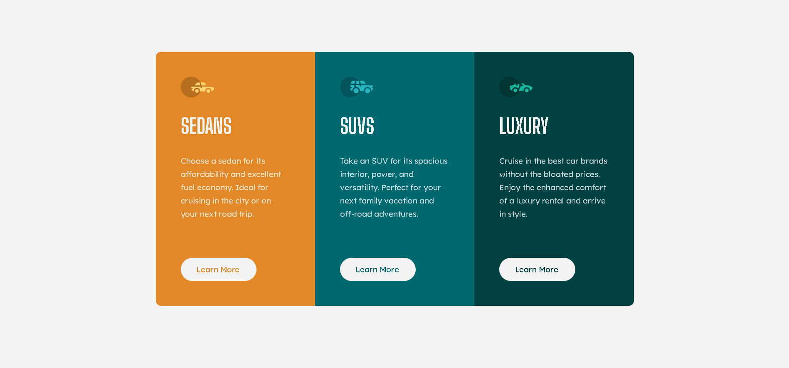

# Frontend Mentor - 3-column preview card component solution

This is a solution to the [3-column preview card component challenge on Frontend Mentor](https://www.frontendmentor.io/challenges/3column-preview-card-component-pH92eAR2-).

## Table of contents

- [Overview](#overview)
  - [Screenshot](#screenshot)
  - [Links](#links)
- [My process](#my-process)
  - [Built with](#built-with)
  - [Continued development](#continued-development)
- [Author](#author)

## Overview

This is my second challenge on the frontend mentor website, the task is to build a 3-column preview card component.
one major difference between this challenge and the previous one is that you have to take responsive design into consideration.

### Screenshot

### Links

- Solution URL: [Add solution URL here](https://your-solution-url.com)
- Live Site URL: [Add live site URL here](https://your-live-site-url.com)

## My process

Grid for the overall layout - for the container that houses the cards - , flex for each indivisual component - for each card - with direction set to column.

### Built with

- HTML
- CSS
- Flexbox
- CSS Grid

### Continued development

I'll focus on practicing Grid, Flexbox, and Responsive Design going forward.

## Author

- Frontend Mentor - [@SafeNSound95](https://www.frontendmentor.io/profile/SafeNSound95)
